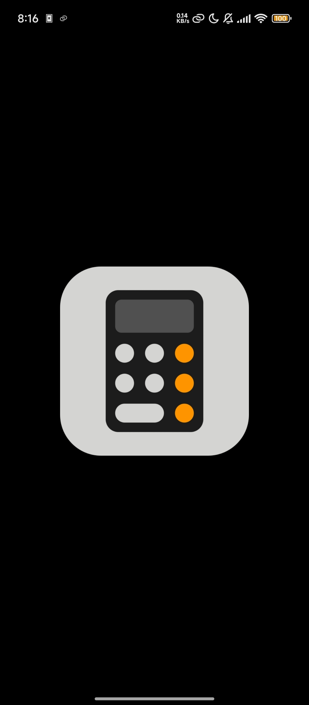
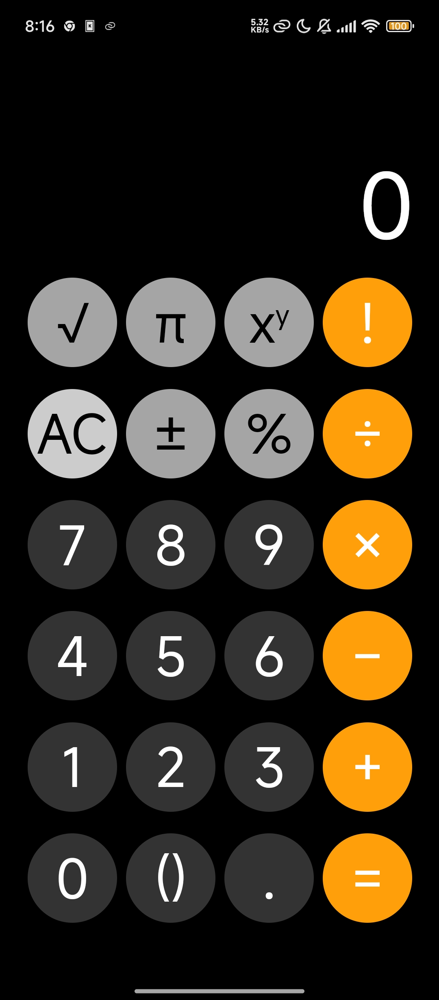
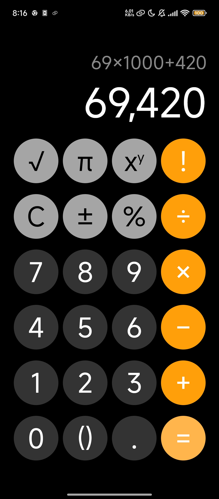

  
  <h1>✨ Simple Calculator ✨</h1>

  
  
  
  
  > 🌟 A sleek, iOS-inspired calculator PWA with dark mode and advanced math operations

---

### 🚀 Key Features

<table>
<tr>
<td>

- 📱 **Mobile-first Design**
- 🌙 **Dark Mode Interface**
- ✨ **iOS-style UI/UX**
- 🔢 **Advanced Operations**
- 💾 **Offline Capable**
- 📲 **Installable on Devices**

</td>
</tr>
</table>

### 📸 App in Action

  
  
  

### 🧮 Operations Support

<table>
<tr>
<td>Basic Operations</td>
<td>Advanced Features</td>
</tr>
<tr>
<td>

- ➕ Addition
- ➖ Subtraction
- ✖️ Multiplication
- ➗ Division

</td>
<td>

- 📐 Square Root (√)
- 🔄 Pi (π) Constant
- ❗ Factorial (!)
- 💯 Percentage
- 🔋 Powers (^)

</td>
</tr>
</table>

### 💻 Tech Stack

### 📱 Device Compatibility

> 💡 This calculator is optimized for mobile devices. Desktop users will see a compatibility notice.

### 📄 License

Released under the [Unlicense](LICENSE). This is free and unencumbered software released into the public domain.

  Built with ❤️ by developers, for developers

